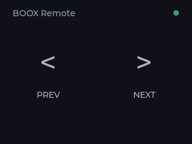

# BOOX Remote

[](https://github.com/xichen-de/boox-page-turn/actions/workflows/ci.yml)

ESP-IDF firmware that turns an M5Stack CoreS3 into a Bluetooth page-turn remote
for BOOX readers.



## Install

Requires an M5Stack CoreS3 and [PlatformIO Core](https://docs.platformio.org/en/latest/core/installation/index.html).

```sh
pio run --target upload
pio device monitor
```

Pair **BOOX Remote** in the reader's Bluetooth settings. **PREV** sends Left
Arrow and **NEXT** sends Right Arrow.

After reflashing or erasing the remote, you may need to forget and pair it
again.

## Behavior

- The status dot is green when connected and gray while advertising.
- After inactivity, the display dims at 5 minutes, turns off at 30 minutes,
  and the remote powers off at 24 hours.
- `LOW` appears at 20% battery or below, `CHG` while charging, and `LOW+` when
  both apply.

## Development

```sh
pio run                            # build without flashing
sh scripts/render_ui_preview.sh    # re-render docs/ui-preview.png after UI changes
```

The UI is in [`src/ui_screen.c`](src/ui_screen.c), device settings are in
[`src/config.h`](src/config.h) and [`src/idle_policy.h`](src/idle_policy.h), and
host checks are in [`test/host`](test/host).

## License

[MIT](LICENSE)
